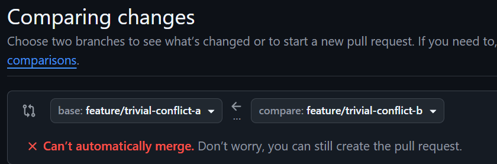
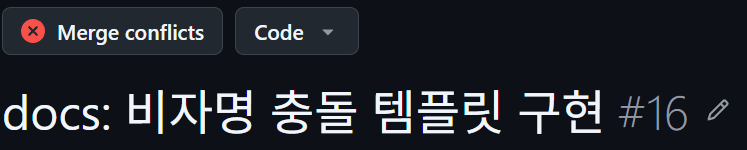
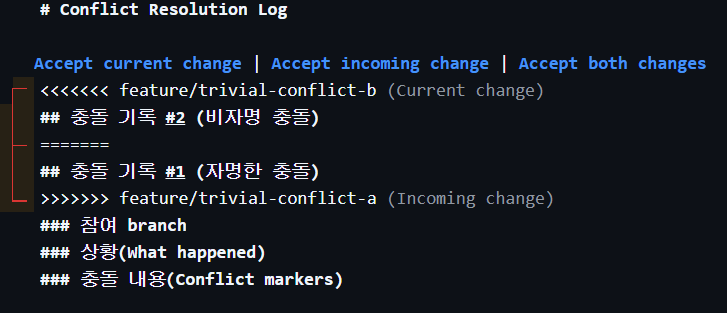
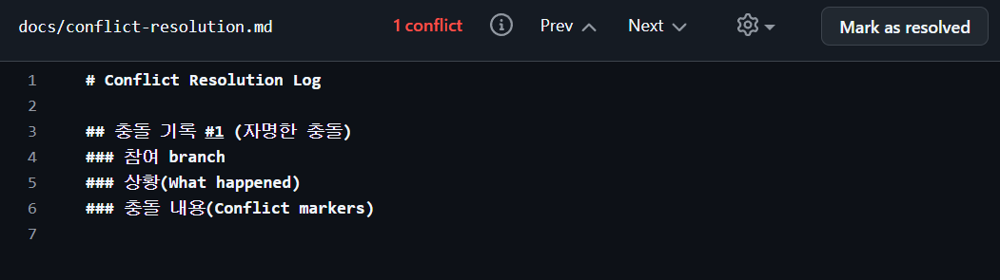

# Conflict Resolution Log

## 충돌 기록 #1 (자명한 충돌)
### 참여자
- 작성자 star-candy(신희수)
- 기준 branch : feature/trivial-conflict-a
- 참여 branch : feature/trivial-conflict-b

### 자명 충돌이란?
- 두 개 이상의 브랜치에서 동일한 파일의 같은 줄을 다르게 수정하고 병합(Merge)을 시도할 때 발생

### 상황(What happened)
- 자명충돌 관련 문서 작성을 위해 feature/trivial-conflict-a branch를 생성함 (a)
- 비자명 충돌 문서 작성을 위해 feature/trivial-conflict-b branch를 생성함 (b)
- branch a에서 docs/conflict-resolution.md 문서를 수정 및 push
- branch b에서 동일 영역을 수정 및 push
- branch b에서 a로 merge하기 위해 pr시 conflict 발생


### 진행 경과
- main을 부모로 하는 feature/trivial-conflict-a branch 생성
- feature/trivial-conflict-a branch를 부모로 하는 feature/trivial-conflict-b branch 생성
- a branch에서 docs/conflict-resolution.md 문서 자명충돌 템플릿 생성 
- 원격으로  push
- b branch에서 docs/conflict-resolution.md 문서 비자명충돌 템플릿 생성 
- 원격으로 push
- b branch에서 a branch로 merge 위한 pr 요청시 자명충돌 발생
- 
- 

### 충돌 내용(Conflict markers)
- 
- 3가지 해결방법 제시됨
    - 현재 branch (b) 내용 수락
    - 기존 branch (a) 내용 수락
    - 두 branch 변경 내용 모두 수락

- 자명충돌을 먼저 실습 후 문서화 하는 것이 목적
    - 따라서 a branch 내용을 남기는 방식으로 conflict를 해결함
    - accept incoming change
- 

#### 충돌 마커는 무슨 의미인가?
```
<<<<< : pr을 보낸, 즉 merge 요청을 보낸 branch (b) conflict 발생 부분을 보여줌

===== : 두 branch 사이를 나누는 구분점

>>>>>> : pr을 받은, 즉 merge 요청을 받은 branch (a) conflict 발생 부분을 보여줌

```

------

## 충돌 기록 #2 (비자명 충돌 - mov-hyun)

### 참여자
- 작성자: mov-hyun
- 상대: star-candy

### 과제 기준
- 과제 요구사항은 "같은 파일의 같은 hunk(인접 라인)를 서로 다르게 수정한 충돌"을 비자명 충돌 조건 중 하나로 제시한다.
- 본 실습은 `docs/conflict-resolution.md`의 첫 hunk를 서로 다르게 수정한 뒤 `origin/main`을 병합하여 충돌을 발생시켰다.

### 상황(What happened)
- mov-hyun은 `feature/nontrivial-conflict-mov-hyun` 브랜치에서 `docs/conflict-resolution.md`의 첫 부분에 비자명 충돌 기록 초안을 작성했다.
- star-candy의 PR #17은 이미 `main`에 병합되어 같은 파일의 첫 부분에 자명 충돌 기록을 추가한 상태였다.
- mov-hyun 브랜치는 PR #17이 병합되기 전의 `main`에서 생성되었기 때문에 최신 `origin/main`을 병합할 때 같은 파일의 같은 hunk에서 충돌이 발생했다.

### 충돌 발생 명령
```powershell
git merge origin/main
```

### 충돌 메시지
```txt
Auto-merging docs/conflict-resolution.md
CONFLICT (content): Merge conflict in docs/conflict-resolution.md
Automatic merge failed; fix conflicts and then commit the result.
```

### 증빙(Evidence)
- 
- 
- 

### 충돌 내용(Conflict markers)
```txt
<<<<<<< HEAD
mov-hyun 브랜치에서 작성한 비자명 충돌 기록 초안
=======
origin/main에 병합된 star-candy의 자명 충돌 기록
>>>>>>> origin/main
```

### 해결 과정(How)
- 팀원이 작성한 자명 충돌 기록은 변경하지 않고 그대로 유지했다.
- mov-hyun의 비자명 충돌 기록을 문서 하단에 새 섹션으로 추가했다.
- 충돌 마커를 제거하고 두 기록이 모두 보존되도록 정리했다.

### 결과(Outcome)
- 자명 충돌 기록은 원문 그대로 유지했다.
- 비자명 충돌 기록과 증빙 이미지를 별도 섹션으로 추가했다.
- 같은 파일의 같은 hunk를 서로 다르게 수정하여 발생한 충돌을 해결했다.

### 배운 점(Learnings)
- 충돌 해결 시 상대가 작성한 기록을 임의로 요약하거나 수정하지 않아야 한다.
- 필요한 내용은 기존 문서 아래에 덧붙이는 방식으로 보존할 수 있다.