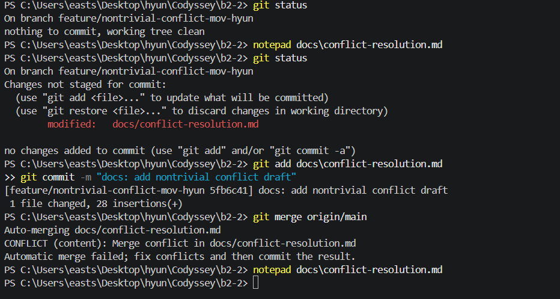
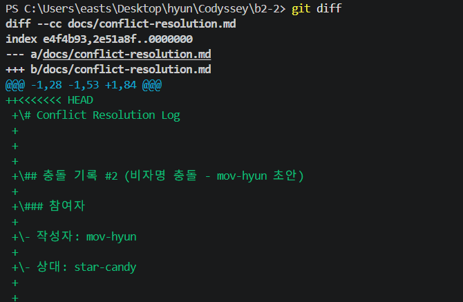
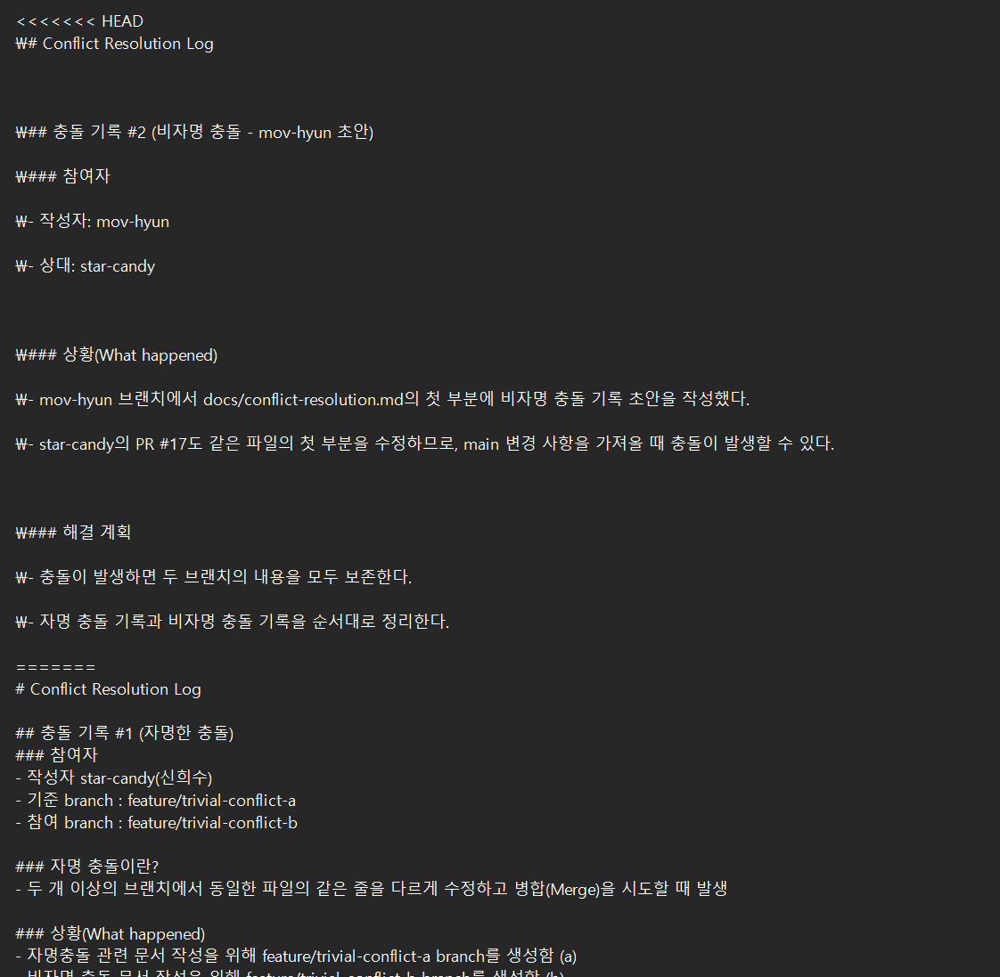

# Conflict Resolution Log

## 충돌 기록 #1 (자명한 충돌)

### 참여자
- 작성자: star-candy(신희수)
- 기준 브랜치: feature/trivial-conflict-a
- 참여 브랜치: feature/trivial-conflict-b

### 상황(What happened)
- 자명 충돌 실습을 위해 `feature/trivial-conflict-a` 브랜치에서 `docs/conflict-resolution.md`를 수정했다.
- 이후 `feature/trivial-conflict-b` 브랜치에서도 같은 파일의 같은 영역을 다르게 수정했다.
- `feature/trivial-conflict-b`를 `feature/trivial-conflict-a`에 병합하려는 과정에서 충돌이 발생했다.

### 충돌 내용(Conflict markers)
~~~txt
<<<<<<< HEAD
feature/trivial-conflict-b에서 작성한 내용
=======
feature/trivial-conflict-a에서 작성한 내용
>>>>>>> feature/trivial-conflict-a
~~~

### 해결 과정(How)
- 충돌 목적이 자명 충돌 발생과 해결 과정을 확인하는 것이었기 때문에 두 브랜치의 차이를 비교했다.
- 문서 구조를 유지하기 위해 기준 브랜치의 내용을 먼저 반영했다.
- 충돌 마커를 제거하고 최종 문서 형태로 정리했다.

### 결과(Outcome)
- 자명 충돌 실습 내용을 `docs/conflict-resolution.md`에 기록했다.
- 관련 PR: #17
- 관련 Issue: #14, #15

### 배운 점(Learnings)
- 같은 파일의 같은 영역을 여러 브랜치에서 수정하면 병합 시 충돌이 발생한다.
- 충돌 마커는 두 변경 내용을 구분해서 보여주는 표시이며, 최종 커밋 전에는 반드시 제거해야 한다.

---

## 충돌 기록 #2 (비자명 충돌 - mov-hyun)

### 참여자
- 작성자: mov-hyun
- 상대: star-candy

### 상황(What happened)
- mov-hyun은 `feature/nontrivial-conflict-mov-hyun` 브랜치에서 `docs/conflict-resolution.md`의 첫 부분에 비자명 충돌 기록 초안을 작성했다.
- star-candy의 PR #17은 이미 `main`에 병합되어 같은 파일의 첫 부분에 자명 충돌 기록을 추가한 상태였다.
- mov-hyun 브랜치는 PR #17이 병합되기 전의 `main`에서 생성되었기 때문에 최신 `origin/main`을 병합할 때 같은 파일의 같은 hunk에서 충돌이 발생했다.

### 충돌 발생 명령
~~~powershell
git merge origin/main
~~~

### 충돌 메시지
~~~txt
Auto-merging docs/conflict-resolution.md
CONFLICT (content): Merge conflict in docs/conflict-resolution.md
Automatic merge failed; fix conflicts and then commit the result.
~~~

### 증빙(Evidence)
- 
- 
- 

### 충돌 내용(Conflict markers)
~~~txt
<<<<<<< HEAD
mov-hyun 브랜치에서 작성한 비자명 충돌 기록 초안
=======
origin/main에 병합된 star-candy의 자명 충돌 기록
>>>>>>> origin/main
~~~

### 해결 과정(How)
- 두 브랜치의 내용이 모두 과제 증빙에 필요하다고 판단했다.
- `origin/main`의 자명 충돌 기록을 위쪽에 유지했다.
- mov-hyun 브랜치의 비자명 충돌 기록을 아래쪽에 별도 섹션으로 정리했다.
- 충돌 마커 `<<<<<<<`, `=======`, `>>>>>>>`를 모두 제거했다.
- 해결 후 아래 명령으로 충돌 해결 커밋을 생성했다.

~~~powershell
git add docs\conflict-resolution.md
git commit -m "docs: resolve nontrivial conflict log"
~~~

### 결과(Outcome)
- 자명 충돌 기록과 비자명 충돌 기록을 모두 보존했다.
- `docs/conflict-resolution.md`에 충돌 발생 상황, 충돌 마커 의미, 해결 과정, 결과를 기록했다.
- 같은 파일의 같은 hunk를 서로 다르게 수정하여 발생한 비자명 충돌을 해결했다.

### 배운 점(Learnings)
- 최신 `main`을 가져오기 전에 오래된 브랜치에서 같은 파일의 같은 영역을 수정하면 병합 충돌이 발생할 수 있다.
- 충돌 해결 시 한쪽 내용을 무조건 버리지 않고, 문서 목적에 맞게 두 변경 사항을 함께 보존할 수 있다.
- 충돌 해결 후에는 충돌 마커가 남아 있지 않은지 확인하고 커밋해야 한다.
