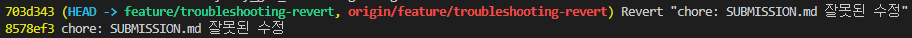

# Troubleshooting Log

## 시나리오: revert
### 참여자
- star-candy(신희수)

### 상황
- 잘못된 내용으로 수정된 `SUBMISSION.md` 파일이 원격 으로 push된 상태
- 다른 팀원들이 최신 branch를 pull받았을 가능성이 있어, 기존 커밋 히스토리를 강제 수정하지 못하는 상태임
- feature/troubleshooting-revert branch를 사용하여 시나리오를 구현한다.

### 시도한 명령/절차
```
SUBMMISSION.md 파일 내용 수정
git add * (변경사항을 커밋 대상 - staging area로 이동)
git commit -m "chore: SUBMISSION.md 잘못된 수정" (변경사항 commit)
git push origin feature/troubleshooting-revert (commit을 원격으로 push)
git log (잘못 push된 커밋의 해시값을 확인)
git revert 8578ef3 (해당 커밋의 변경 사항을 되돌림)

- Vim 에디터가 실행되어 자동 생성된 메시지(`Revert "chore: 잘못된 수정"`)를 확인하고 그대로 저장(:wq).

git push origin feature/troubleshooting-revert 명령어로 되돌린 작업 내역을 반영.
```

### 결과
- 잘못 변경되었던 SUBMISSION.md 내용이 이전 commit 상태로 복원됨
- 기존의 잘못된 커밋 내역이 삭제되지 않고 그대로 유지된 채, 그 위에 '되돌리는 작업을 수행했다'는 새로운 Revert 커밋이 추가로 쌓임.
- 

### 왜 이 방법을 선택했는가(Why)
- **`reset` 대신 `revert`를 선택한 이유:** 문제가 된 커밋이 로컬에만 있었다면 `git reset`을 사용하여 커밋 자체를 깔끔하게 없앴을 것입니다. 하지만 **이미 원격 저장소에 push되어 공유된 커밋**이었기 때문입니다. 
- 만약 `reset`을 사용한 뒤 `git push -f`(강제 푸시)를 했다면, 다른 팀원들의 로컬 저장소 히스토리와 원격 저장소 히스토리가 엇갈려 심각한 충돌과 혼란을 유발했을 것입니다. 따라서 히스토리를 훼손하지 않고 안전하게 변경 사항만 취소하는 `revert`를 선택했습니다.