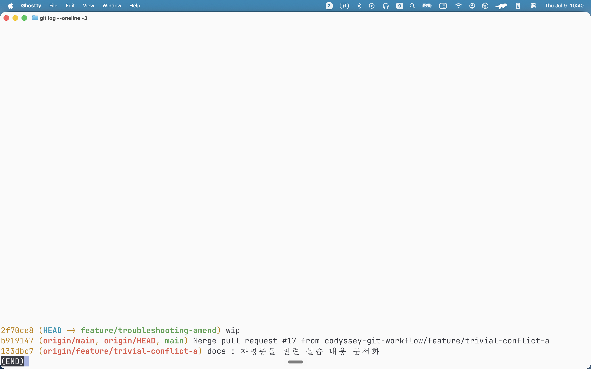
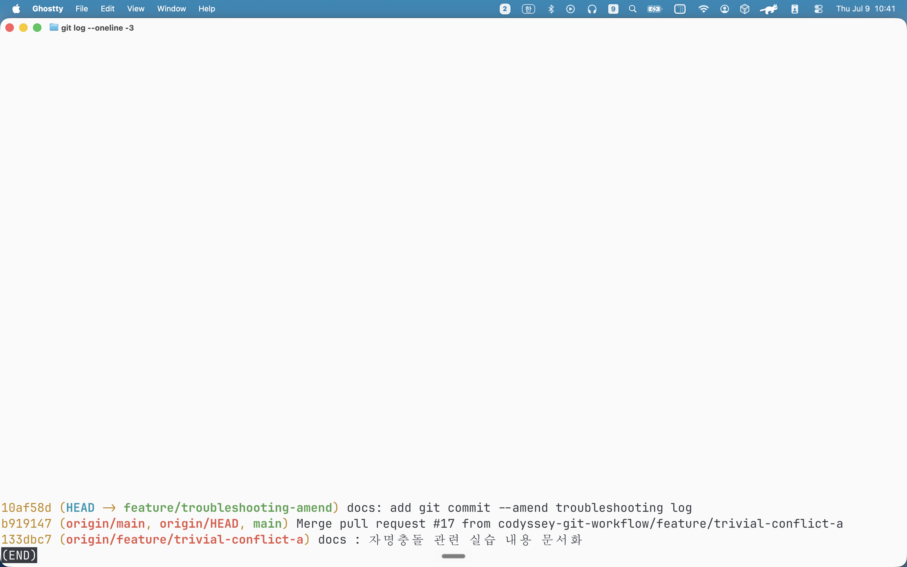
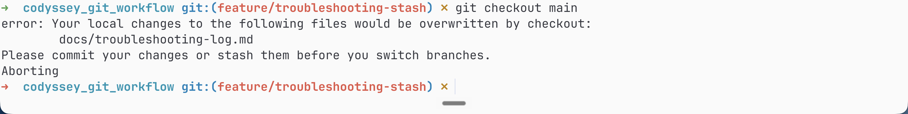
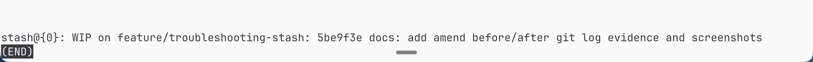
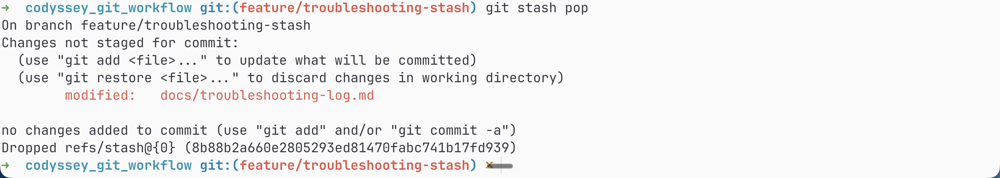
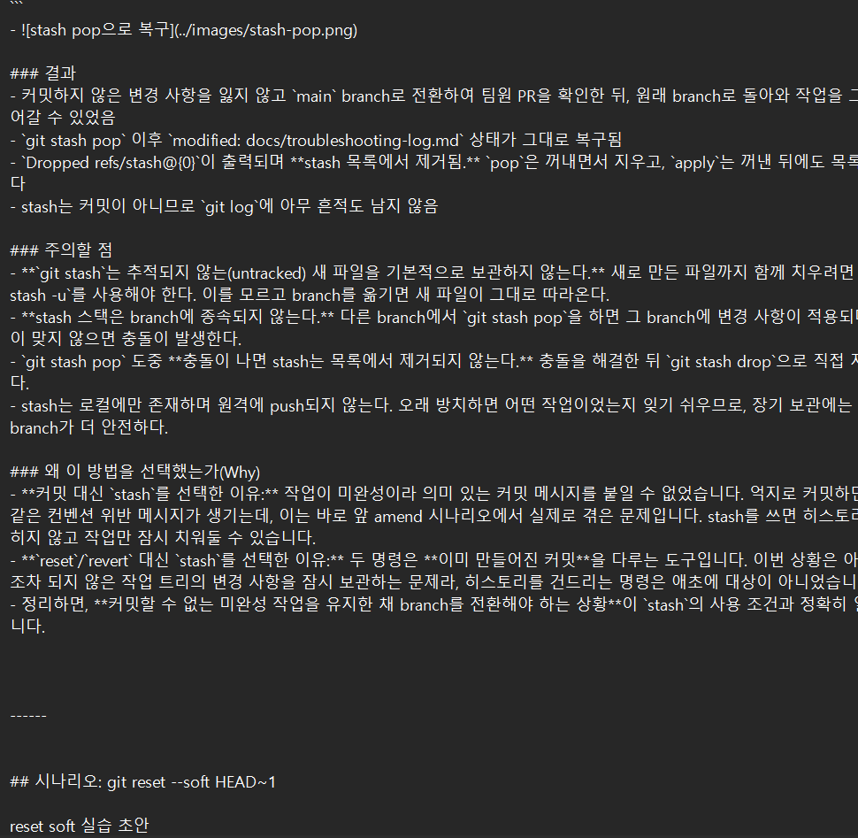
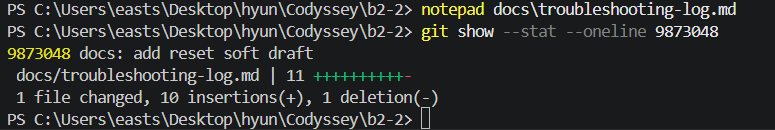
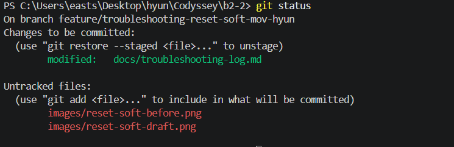
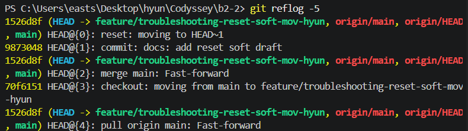

# Troubleshooting Log

## 시나리오: revert
### 참여자
- star-candy(신희수)

### 상황
- 잘못된 내용으로 수정된 `SUBMISSION.md` 파일이 원격 으로 push된 상태
- 다른 팀원들이 최신 branch를 pull받았을 가능성이 있어, 기존 커밋 히스토리를 강제 수정하지 못하는 상태임
- feature/troubleshooting-revert branch를 사용하여 시나리오를 구현한다.

### 시도한 명령/절차
```
SUBMMISSION.md 파일 내용 수정
git add * (변경사항을 커밋 대상 - staging area로 이동)
git commit -m "chore: SUBMISSION.md 잘못된 수정" (변경사항 commit)
git push origin feature/troubleshooting-revert (commit을 원격으로 push)
git log (잘못 push된 커밋의 해시값을 확인)
git revert 8578ef3 (해당 커밋의 변경 사항을 되돌림)

- Vim 에디터가 실행되어 자동 생성된 메시지(`Revert "chore: 잘못된 수정"`)를 확인하고 그대로 저장(:wq).

git push origin feature/troubleshooting-revert 명령어로 되돌린 작업 내역을 반영.
```

### 결과
- 잘못 변경되었던 SUBMISSION.md 내용이 이전 commit 상태로 복원됨
- 기존의 잘못된 커밋 내역이 삭제되지 않고 그대로 유지된 채, 그 위에 '되돌리는 작업을 수행했다'는 새로운 Revert 커밋이 추가로 쌓임.
- 

### 왜 이 방법을 선택했는가(Why)
- **`reset` 대신 `revert`를 선택한 이유:** 문제가 된 커밋이 로컬에만 있었다면 `git reset`을 사용하여 커밋 자체를 깔끔하게 없앴을 것입니다. 하지만 **이미 원격 저장소에 push되어 공유된 커밋**이었기 때문입니다. 
- 만약 `reset`을 사용한 뒤 `git push -f`(강제 푸시)를 했다면, 다른 팀원들의 로컬 저장소 히스토리와 원격 저장소 히스토리가 엇갈려 심각한 충돌과 혼란을 유발했을 것입니다. 따라서 히스토리를 훼손하지 않고 안전하게 변경 사항만 취소하는 `revert`를 선택했습니다.

------

## 시나리오: amend
### 참여자
- yun-lim(임대균)

### 상황
- `docs/troubleshooting-log.md`에 amend 시나리오 초안을 작성하고 커밋했으나, 커밋 메시지를 `wip`으로 남김
- `wip`은 `docs/CONTRIBUTING.md`의 커밋 컨벤션에서 **명시적으로 금지한 메시지**임 (변경 대상을 유추할 수 없음)
- 해당 커밋은 **아직 원격에 push하지 않은 상태**이며, feature/troubleshooting-amend branch에서만 존재함
- feature/troubleshooting-amend branch를 사용하여 시나리오를 구현한다.

### 시도한 명령/절차
```
docs/troubleshooting-log.md 파일에 amend 시나리오 초안 작성
git add docs/troubleshooting-log.md (변경사항을 staging area로 이동)
git commit -m "wip" (컨벤션에 어긋나는 메시지로 commit)
git log --oneline -3 (잘못된 메시지와 커밋 해시를 확인)

git commit --amend -m "docs: add git commit --amend troubleshooting log"
- -m 옵션을 주면 에디터가 열리지 않고 메시지가 바로 교체됨
- -m 없이 실행하면 편집기가 열리며, 메시지 수정 후 저장(:wq)

git log --oneline -3 (메시지가 바뀌고 커밋 해시도 함께 바뀐 것을 확인)
git push origin feature/troubleshooting-amend (amend 완료 후 최초 push)
```

#### amend 전 `git log --oneline -3`
```txt
2f70ce8 (HEAD -> feature/troubleshooting-amend) wip
b919147 (origin/main, origin/HEAD, main) Merge pull request #17 from codyssey-git-workflow/feature/trivial-conflict-a
133dbc7 (origin/feature/trivial-conflict-a) docs : 자명충돌 관련 실습 내용 문서화
```
- 

#### amend 후 `git log --oneline -3`
```txt
10af58d (HEAD -> feature/troubleshooting-amend) docs: add git commit --amend troubleshooting log
b919147 (origin/main, origin/HEAD, main) Merge pull request #17 from codyssey-git-workflow/feature/trivial-conflict-a
133dbc7 (origin/feature/trivial-conflict-a) docs : 자명충돌 관련 실습 내용 문서화
```
- 

### 결과
- 커밋 메시지가 `wip` → `docs: add git commit --amend troubleshooting log`로 수정되어 커밋 컨벤션을 만족하게 됨
- **커밋 해시가 `2f70ce8` → `10af58d`로 함께 변경됨.** 메시지만 갈아끼운 것이 아니라, 같은 변경 내용을 담은 **새로운 커밋 객체가 생성되어 기존 커밋을 대체**한 것임
- 부모 커밋(`b919147`, `133dbc7`)은 그대로 유지됨. amend는 **직전 커밋 1개에만** 영향을 줌
- 대체된 `2f70ce8`은 히스토리에서 떨어져 나갔지만 로컬 `git reflog`에는 남아 있어, 실수한 경우 `git reset --hard 2f70ce8`로 되돌릴 수 있음

```txt
$ git reflog -2
10af58d HEAD@{0}: commit (amend): docs: add git commit --amend troubleshooting log
2f70ce8 HEAD@{1}: commit: wip
```

### 주의할 점 (원격 히스토리/협업 영향)
- **amend는 반드시 `push` 이전에 수행한다.** 이미 push한 커밋을 amend하면 원격에는 옛 커밋(`2f70ce8`)이, 로컬에는 새 커밋(`10af58d`)이 남아 히스토리가 갈라진다. 이를 맞추려면 `git push --force`가 필요한데, 강제 푸시는 **팀 합의 없이 금지**되어 있다(다른 팀원의 로컬 히스토리와 원격이 엇갈림).
- 이번 실습에서는 `wip` 커밋을 push하지 않은 상태에서 amend했기 때문에, 이후 `git push`를 강제 옵션 없이 한 번만 수행하면 되었다.

### 왜 이 방법을 선택했는가(Why)
- **`revert` 대신 `amend`를 선택한 이유:** 문제는 커밋의 *내용*이 아니라 *메시지*였고, 해당 커밋은 아직 로컬에만 존재했습니다. `revert`는 원격에 공유된 커밋을 되돌릴 때 쓰는 방법이라, 되돌리는 커밋이 하나 더 쌓여 히스토리만 지저분해집니다.
- **`reset --soft` 대신 `amend`를 선택한 이유:** `git reset --soft HEAD~1` 후 다시 커밋해도 결과는 같지만, 직전 커밋의 메시지만 고치는 경우에는 `amend` 한 줄이면 충분합니다. `reset`은 커밋을 되돌려 여러 변경을 다시 묶거나 나눌 때 더 적합합니다.
- 정리하면, **아직 push하지 않은 직전 커밋의 메시지 수정**이라는 조건이 `amend`의 사용 조건과 정확히 일치했습니다.

------

## 시나리오: stash / stash pop
### 참여자
- yun-lim(임대균)

### 상황
- feature/troubleshooting-stash branch에서 `docs/troubleshooting-log.md`에 stash 시나리오를 작성하던 중, **아직 커밋할 수 없는 미완성 상태**였음
- 이때 팀원(mov-hyun)의 PR을 확인하기 위해 `main` branch로 잠시 전환해야 하는 상황이 발생함
- 해당 파일은 `main`과 현재 branch에서 내용이 다르기 때문에, 작업 내용을 그대로 둔 채 branch를 전환하면 변경 사항이 덮어써질 수 있음
- 실제로 `git checkout main`을 시도하면 git이 전환을 거부함
- feature/troubleshooting-stash branch를 사용하여 시나리오를 구현한다.

### 시도한 명령/절차
```
docs/troubleshooting-log.md 파일에 stash 시나리오 작성 (커밋하지 않은 상태)
git status (변경 사항이 staged/unstaged 상태로 남아있음을 확인)

git checkout main (branch 전환 시도 -> git이 거부함)

git stash (커밋하지 않은 변경 사항을 임시 보관하고 작업 트리를 깨끗하게 만듦)
git stash list (보관된 stash 목록 확인)
git status (변경 사항이 사라지고 clean 상태가 된 것을 확인)

git checkout main (이제 branch 전환 성공)
- main에서 확인할 작업 수행

git checkout feature/troubleshooting-stash (원래 branch로 복귀)
git stash pop (보관해둔 변경 사항을 복구하고 stash 목록에서 제거)
git status (작성 중이던 변경 사항이 그대로 복구된 것을 확인)
```

#### branch 전환이 거부되는 상황
```txt
$ git checkout main
error: Your local changes to the following files would be overwritten by checkout:
	docs/troubleshooting-log.md
Please commit your changes or stash them before you switch branches.
Aborting
```
- git이 직접 **"commit 하거나 stash 하라"**고 안내한다. 커밋할 수 없는 미완성 작업이므로 stash를 선택한다.
- 

#### `git stash` 후 `git stash list`
```txt
$ git stash list
stash@{0}: WIP on feature/troubleshooting-stash: 5be9f3e docs: add amend before/after git log evidence and screenshots
```
- `5be9f3e`는 **stash를 뜬 시점의 HEAD 커밋**이다. stash는 이 커밋을 기준으로 한 변경 사항을 보관한다.
- 이 상태에서 작업 트리가 깨끗해지므로 `git checkout main`이 정상 동작한다.
- 

#### `git stash pop` 으로 복구
```txt
$ git stash pop
On branch feature/troubleshooting-stash
Changes not staged for commit:
  (use "git add <file>..." to update what will be committed)
  (use "git restore <file>..." to discard changes in working directory)
	modified:   docs/troubleshooting-log.md

no changes added to commit (use "git add" and/or "git commit -a")
Dropped refs/stash@{0} (8b88b2a660e2805293ed81470fabc741b17fd939)
```
- 

### 결과
- 커밋하지 않은 변경 사항을 잃지 않고 `main` branch로 전환하여 팀원 PR을 확인한 뒤, 원래 branch로 돌아와 작업을 그대로 이어갈 수 있었음
- `git stash pop` 이후 `modified: docs/troubleshooting-log.md` 상태가 그대로 복구됨
- `Dropped refs/stash@{0}`이 출력되며 **stash 목록에서 제거됨.** `pop`은 꺼내면서 지우고, `apply`는 꺼낸 뒤에도 목록에 남긴다
- stash는 커밋이 아니므로 `git log`에 아무 흔적도 남지 않음

### 주의할 점
- **`git stash`는 추적되지 않는(untracked) 새 파일을 기본적으로 보관하지 않는다.** 새로 만든 파일까지 함께 치우려면 `git stash -u`를 사용해야 한다. 이를 모르고 branch를 옮기면 새 파일이 그대로 따라온다.
- **stash 스택은 branch에 종속되지 않는다.** 다른 branch에서 `git stash pop`을 하면 그 branch에 변경 사항이 적용되며, 내용이 맞지 않으면 충돌이 발생한다.
- `git stash pop` 도중 **충돌이 나면 stash는 목록에서 제거되지 않는다.** 충돌을 해결한 뒤 `git stash drop`으로 직접 지워야 한다.
- stash는 로컬에만 존재하며 원격에 push되지 않는다. 오래 방치하면 어떤 작업이었는지 잊기 쉬우므로, 장기 보관에는 임시 branch가 더 안전하다.

### 왜 이 방법을 선택했는가(Why)
- **커밋 대신 `stash`를 선택한 이유:** 작업이 미완성이라 의미 있는 커밋 메시지를 붙일 수 없었습니다. 억지로 커밋하면 `wip` 같은 컨벤션 위반 메시지가 생기는데, 이는 바로 앞 amend 시나리오에서 실제로 겪은 문제입니다. stash를 쓰면 히스토리를 더럽히지 않고 작업만 잠시 치워둘 수 있습니다.
- **`reset`/`revert` 대신 `stash`를 선택한 이유:** 두 명령은 **이미 만들어진 커밋**을 다루는 도구입니다. 이번 상황은 아직 커밋조차 되지 않은 작업 트리의 변경 사항을 잠시 보관하는 문제라, 히스토리를 건드리는 명령은 애초에 대상이 아니었습니다.
- 정리하면, **커밋할 수 없는 미완성 작업을 유지한 채 branch를 전환해야 하는 상황**이 `stash`의 사용 조건과 정확히 일치했습니다.


------


## 시나리오: git reset --soft HEAD~1
### 참여자
- mov-hyun(이동현)

### 상황
- `docs/troubleshooting-log.md`에 reset soft 실습 초안을 작성하고 `docs: add reset soft draft` 커밋을 만들었다.
- 해당 커밋은 아직 원격에 push하지 않은 로컬 커밋이었다.
- 초안 커밋을 취소하되 작성한 변경 내용은 유지한 뒤, 내용을 정리해서 새 커밋으로 다시 기록해야 했다.
- feature/troubleshooting-reset-soft-mov-hyun branch를 사용하여 시나리오를 구현한다.

### 시도한 명령/절차
```
docs/troubleshooting-log.md 파일에 reset soft 실습 초안 작성
git add docs/troubleshooting-log.md
git commit -m "docs: add reset soft draft"

git reset --soft HEAD~1
git status
```

### 증빙(Evidence)
- 
- 
- 
- 

### 결과
- 최근 로컬 커밋인 `docs: add reset soft draft`가 취소되었다.
- 파일 변경 내용은 사라지지 않고 staged 상태로 유지되었다.
- 초안 내용을 정리한 뒤 `docs: document reset soft troubleshooting` 커밋으로 다시 기록할 수 있게 되었다.

### 주의할 점
- `git reset --soft HEAD~1`은 최근 커밋만 취소하고 변경 내용은 staging area에 남긴다.
- reset 후 문서를 다시 수정했다면, 최종 내용을 반영하기 위해 `git add docs/troubleshooting-log.md`를 다시 실행해야 한다.
- 이미 원격에 push되어 팀원과 공유된 커밋에는 reset을 사용하지 않는다. 공유된 커밋을 되돌릴 때는 `git revert`를 사용한다.
- `git reset --hard HEAD~1`은 커밋과 작업 내용까지 함께 삭제할 수 있으므로, 변경 내용을 보존해야 하는 상황에서는 사용하지 않는다.

### 왜 이 방법을 선택했는가(Why)
- **`reset --soft`를 선택한 이유:** 문제의 커밋은 아직 원격에 push하지 않은 로컬 커밋이었다. 커밋 기록만 취소하고 작성한 내용은 유지해야 했기 때문에 `--soft` 옵션이 적합했다.
- **`revert`가 적합한 경우:** 원격에 push되어 팀원과 공유된 커밋을 되돌릴 때는 `revert`를 사용한다. 이번 커밋은 로컬에만 있었기 때문에 되돌림 커밋을 추가할 필요가 없었다.
- **`reset --hard`가 적합하지 않은 이유:** 작성한 문서 내용은 보존해야 했다. `--hard`는 작업 내용까지 잃을 수 있으므로 이번 상황에 맞지 않는다.
- 정리하면, **아직 push하지 않은 최근 로컬 커밋을 취소하고 변경 내용은 유지해야 하는 상황**이 `git reset --soft HEAD~1`의 사용 조건과 일치했다.